# Autonomous Image Localization for Visual Inspection of Civil Infrastructure

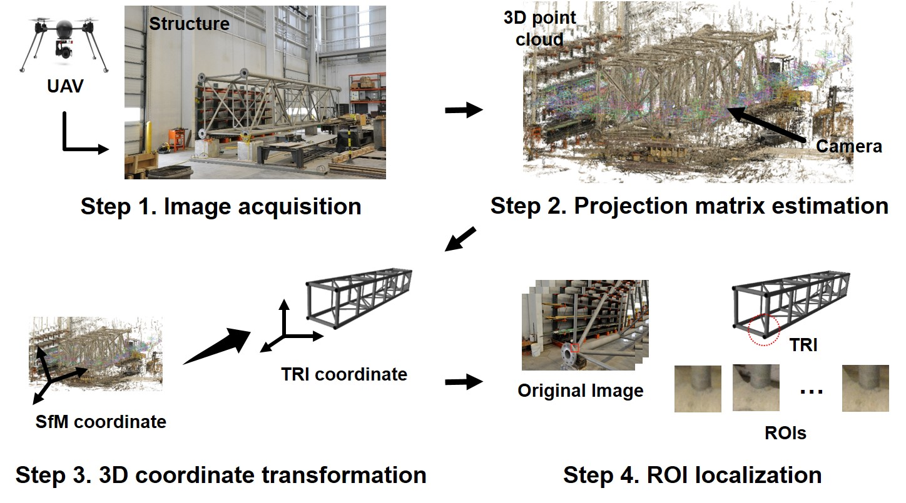

## Description
Low-cost, high-performance vision sensors in conjunction with aerial sensing platforms are providing new possibilities for achieving autonomous visual inspection in civil engineering structures. **A large volume of images** of a given structure can readily be collected for use in visual inspection, overcoming spatial and temporal limitations associated with human-based inspection. Although researchers have explored several algorithms and techniques for vision-based inspection in recent decades, a major challenge in past implementations lies in dealing with **a high volume of images while only a small fraction of them are important for actual inspection.** Because processing irrelevant images can generate a significant number of false-positives, **automated visual inspection techniques should be used in coordination with methods to localize relevant regions on the images**. When combined, automated visual inspection will be able to meet the objectives and quality of human visual inspection. To enable this technology, **we develop and validate a novel automated image localization technique to extract regions of interest (ROIs) on each of the images before utilizing vision-based damage detection techniques.** ROIs are the portions of an image that contain the physical region of the structure that is targeted for visual interrogation, denoted as the targeted region of interest (TRI). ROIs are computed based on the geometric relationship between the collected images and the TRIs. Analysis of such highly relevant and localized images would enable efficient and reliable visual inspection. We successfully demonstrate the capability of the technique to extract the ROIs using a full-scale highway sign structure in the case where weld connections serve as the TRIs. 

## Publication

* **Chul Min Yeum**, Jongseong Choi, and Shirley J. Dyke. “Autonomous image localization for visual inspection of civil infrastructure” ***accepted for Smart Materials and Structures*** (December,2016). **Please send me an email to read this paper before it is available in online.** 

* **Chul Min Yeum**,  Jongseong Choi, and Shirley J. Dyke. “Image localization for computer-enhanced visual inspection of civil infrastructure," ***submitted to Engineering Mechanics Institute (EMI) Conference***, San Diego, CA, June 4-7 2017. 

* **Chul Min Yeum**. “Computer Vision-Based Structural Assessment Exploiting Large Volumes of Images,"  (Doctoral dissertation), Lyles School of Civil Engineering, Purdue University, West Lafayette, Indiana, USA, December 2016. [**[PPT]**](Files\Dissertation\2016_PhD_Defence_CM_Final.pdf).

## Collaborators
* [**Shirley J. Dyke**](https://engineering.purdue.edu/IISL/)
* Jongseong Choi

## Acknowledgment
The authors thank Kevin Brower and Harry Tidrick at the Bowen lab for placing and assembling the full-scale truss and Prof. Robert Connor at Purdue University for helping to acquire the truss used in this study. 

## Source Code & Data
* All source code are released in this repository. 
* You can download original images and result files from this link [[**Link**]]().  
* All three datasets are published through this link, but, result images of 'dataset1' are only inlcluded.  
* If you use the codes and images for your publication, **please cite my paper(s).**

## Setup

**Display the result images in the paper**  

1. Clone (or download) the source code in Github into a directory of your choice (say, *baseFolder*). 
2. Download and unzip 'Dataset1.zip' and place them in 'data' folder in *baseFolder*. 
3. Run `RunOutput.m`. 

**Do it your own images**  
Please contact me or submit "issues" in this repository, and I can help you in person. 

## Sample Results 
### Description of a full-scale highyway sign structure
This segment of the full-scale high way sign structure is composed of six cubic segments. It has four main chords, twenty-eight vertical braces, twenty-four diagonal braces, and seven internal diagonal-to-main chord braces. All braces are tubular sections. The diameters of the main chord, vertical brace, and diagonal (including internal) brace are 152.4, 63.5, and 76.2 mm, respectively. All braces are connected to the main chords by welds, for a total of 118 welded connections. **These welded connections are assigned as the TRIs** for purposes of validation of RILVI. The structure generally has a clean surface condition with no unusual corruption or damage to its components.

Dimensions of the structure and layouts of reference points |  Two different sizes of the welds defined as target region of interest (TRI)
:----------------------------------------------:|:-------------------------:
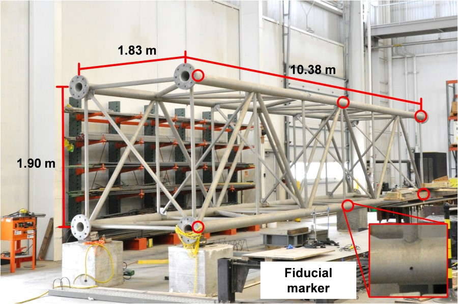     |  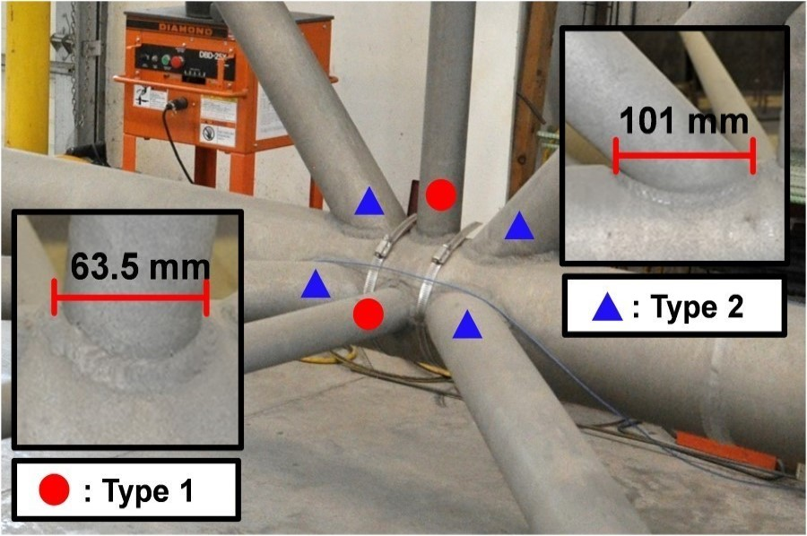

### Images of the full-scale highway sign structure
A total of 789 images are collected, all of which are used for localizing ROIs.

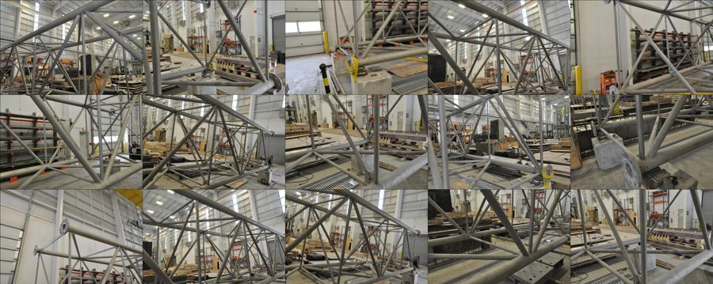

### Transformation of the coordinate system	
Twelve fiducial marks are manually marked on the main chords (six dots on the front and six on the back),called reference points. Each circular dot has a 1 cm diameter, which is chosen to be visible on the collected images. **We know each of their 3D locations in the TRI coordinate system, and manually find the corresponding dots across the images to define 3D locations in the SfM coordinate system. ** Finally, we will obtain M (transformation matrix) using these two sets of corresponding points in two different coordinate systems.

This image shows that how M is accurately estimated. Please refer to equations in Section 2.3 in the paper. 

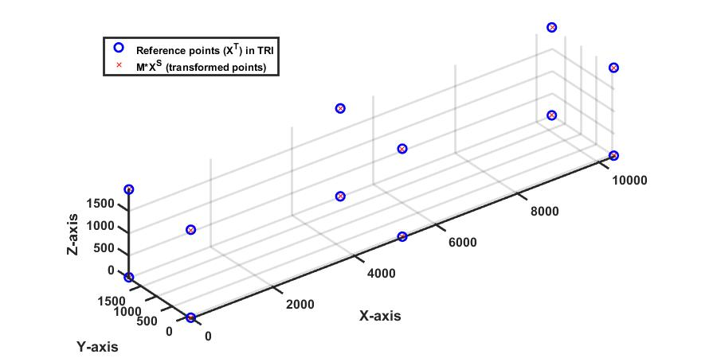;

### Re-projection of the reference point to one of images
A point of a marker (called reference point) is selected on each of image (red circle). Then, corresponding 3D point (Xs) in SfM coordinate is estimated using a set of these points across multiple images. If Xs are correctly estimated from the points, P x Xs are projected on the same point of the reference point on the image (green circle). We estimate the M matrix using a set of Xs and Xt using 7-parameter transformation. If M is correctly estimated, XT is also projected on the same point of the reference point using transformed projection matrix (P x inv(M)). This image explains that they are projected at the almost similar image point, 

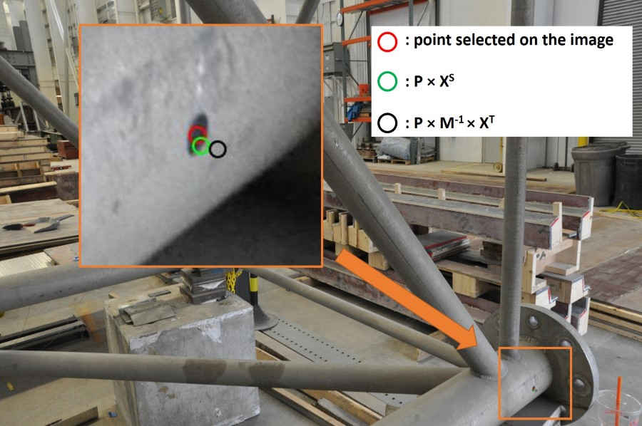;

### Localized Region-of-interest on each images
These images shows several results showing localized ROIs on the images. Only the TRIs close to the camera location (having sufficient ROI size) are selected as valid ROIs. 

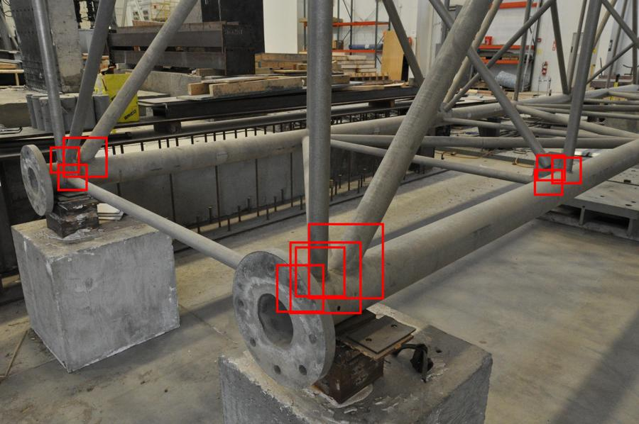 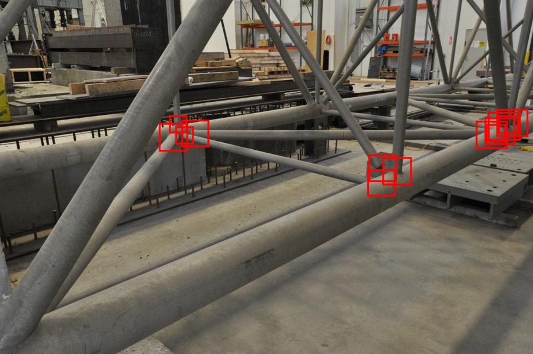
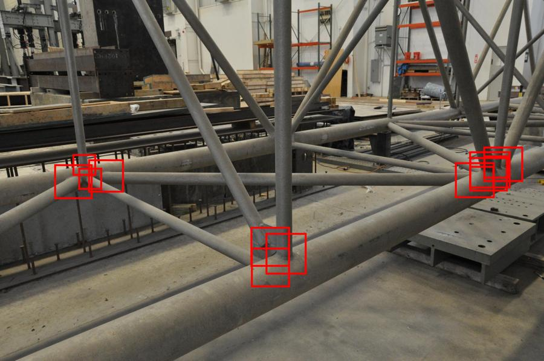  

### Regions-of-interest (ROIs) corresponding to the identical TRI, which are extracted from different images
The ROIs of all 118 TRIs are localized in each of the collected images. Examples of the ROIs obtained are shown below. Since the original images are collected from various angles and positions, the ROIs include various viewpoints of the TRI, although their scale is almost identical. Depending on the viewpoints, its view is impeded by the geometric features of the structure.

An example of the Type 1 weld connection |  An example of the Type 2 weld connection
:----------------------------------------------:|:-------------------------:
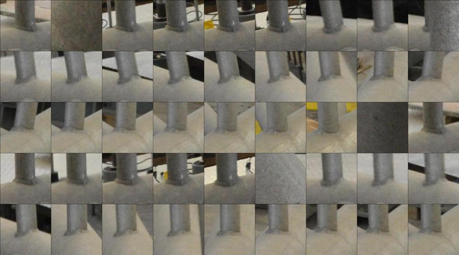    |  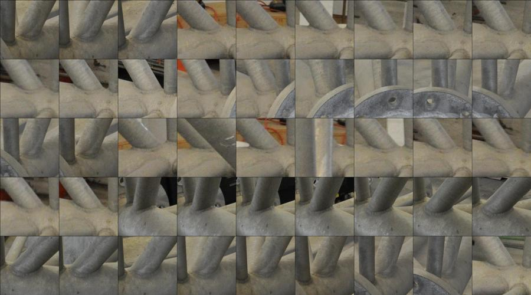

 

